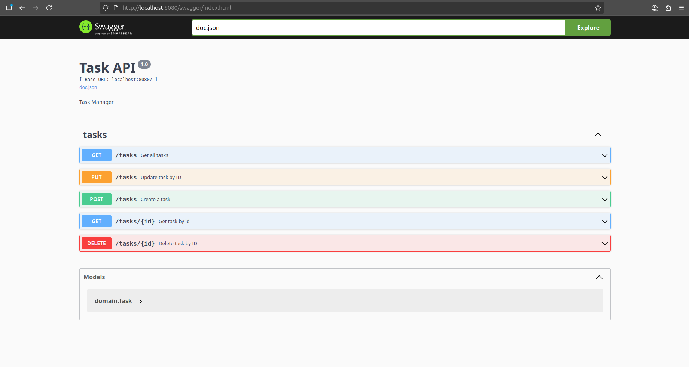

> **Task-api**: This API was designed in the intention of handling list of tasks in and out our database, allowing users to create a task and saving into the database 
> of their choice (for now: either in psql or mysql), get all tasks avaliable in the database, get a task using the ID, update contents of a task (whether the
> title, description or both) and delete task from a database by ID.

**Prerequisites** <br>
Before using the API, make sure to either have either mysql or postgres (psql) in your operating system installed. Also make sure to run the schema below either in mysql
or in psql (recommend using shell or bash). <br>
**Schema**: <br>
*For MySQL* - <br>
```sql
CREATE DATABASE taskdb;
USE taskdb;

CREATE TABLE tasks (
id CHAR(36) PRIMARY KEY,
title VARCHAR(150) NOT NULL,
description VARCHAR(300) NOT NULL
);
```
*For psql in bash or in sql_shell* -
**SQL**
```sql
CREATE DATABASE task_api;
\c task_api

CREATE TABLE tasks (
id CHAR(36) PRIMARY KEY,
title VARCHAR(150) NOT NULL,
description VARCHAR(300) NOT NULL
);
```
For testing, you can add these samples to your database: <br>
**SQL**
```sql
INSERT INTO tasks (id,title,description) VALUES ('1161377b-7c47-45aa-b087-1a9b08423021','test1','testing123');
INSERT INTO tasks (id,title,description) VALUES ('18fd5e4b-d137-477f-a499-06ef11859292','test2','testing456');
INSERT INTO tasks (id,title,description) VALUES ('3ce5ceec-6c5a-11f0-9dac-68ecc56cca7d','test3','testing789');
```

**Guides on how to use**<br>
*For Windows*: use powershell on terminal<br>
*For linux*: use bash on terminal<br>
After having the repository saved in a folder and opening it on your IDE, in .env file under the /cmd folder, configure the values in the .env file to the settings of database found in either MySQL or Postgres: <br>
**env**
```env
DBUSER='your_user_name' 
-> make sure it is in single quote

DBPASS='your_password for the user' 
-> make sure it is in single quote

DBNET=tcp 
-> type of network. in default settings, it is tcp

DBADR='127.0.0.1:3306' 
-> address of your database if using MySQL. by default, it is '127.0.0.1:3306'. ignore if using Postgres

DBHOST=localhost 
-> type of host for your database if using Postgres. by default, it is 'localhost'. ignore if using MySQL

DBPORT=5432 
-> port number of your database if using Postgres. by default, it is 5432. ignore if using MySQL
```
once configured, if you have 'make' install on powershell, run the following command on your terminal:<br>
**powershell**
```powershell
make run
```
If not run the following command: <br>
**powershell**
```powershell
go run cmd/main.go
```
Once run, you will see this prompt message on the terminal:<br>
**powershell**
```powershell
go run cmd/main.go
For MySQL:1, For Postgres:2
```
If using MySQL, enter the number "1" in the terminal and press ENTER<br>
If using Postgres, enter the number "2" in the terminal and press ENTER. If the .env file is configured correctly, the prompt below will appear in the terminal: <br>
**powershell**
```powershell
[GIN-debug] [WARNING] Creating an Engine instance with the Logger and Recovery middleware already attached.

[GIN-debug] [WARNING] Running in "debug" mode. Switch to "release" mode in production.
 - using env:   export GIN_MODE=release
 - using code:  gin.SetMode(gin.ReleaseMode)

[GIN-debug] GET    /swagger/*any             --> github.com/swaggo/gin-swagger.CustomWrapHandler.func1 (3 handlers)
[GIN-debug] POST   /tasks                    --> task-api/internal/adapter/inbound/http.HttpHandler.CreateTask-fm (3 handlers)
[GIN-debug] GET    /tasks                    --> task-api/internal/adapter/inbound/http.HttpHandler.GetAll-fm (3 handlers)
[GIN-debug] GET    /tasks/:id                --> task-api/internal/adapter/inbound/http.HttpHandler.GetByID-fm (3 handlers)
[GIN-debug] PUT    /tasks                    --> task-api/internal/adapter/inbound/http.HttpHandler.UpdateTask-fm (3 handlers)
[GIN-debug] DELETE /tasks/:id                --> task-api/internal/adapter/inbound/http.HttpHandler.Delete-fm (3 handlers)
[GIN-debug] [WARNING] You trusted all proxies, this is NOT safe. We recommend you to set a value.
Please check https://pkg.go.dev/github.com/gin-gonic/gin#readme-don-t-trust-all-proxies for details.
[GIN-debug] Listening and serving HTTP on localhost:8080
```
Next, head over to the browser of your choice and visit the following website:<br>
**URL**
```url
http://localhost:8080/swagger/index.html
```
<br><br>
If everything is done correctly so far you should see this on your browser:<br>


<br><br>
You should also be able to see this prompt on your terminal meaning it your API is working well on the browser:<br>
**powershell**
```powershell
[GIN] 2025/08/01 - 11:56:25 | 200 |    1.132181ms |       127.0.0.1 | GET      "/swagger/index.html"
[GIN] 2025/08/01 - 11:56:25 | 200 |     913.578µs |       127.0.0.1 | GET      "/swagger/swagger-ui.css"
[GIN] 2025/08/01 - 11:56:25 | 200 |    3.230235ms |       127.0.0.1 | GET      "/swagger/swagger-ui-bundle.js"
[GIN] 2025/08/01 - 11:56:25 | 200 |     934.024µs |       127.0.0.1 | GET      "/swagger/swagger-ui-standalone-preset.js"
[GIN] 2025/08/01 - 11:56:26 | 200 |     201.862µs |       127.0.0.1 | GET      "/swagger/favicon-16x16.png"
[GIN] 2025/08/01 - 11:56:26 | 200 |     500.622µs |       127.0.0.1 | GET      "/swagger/doc.json"
``` 